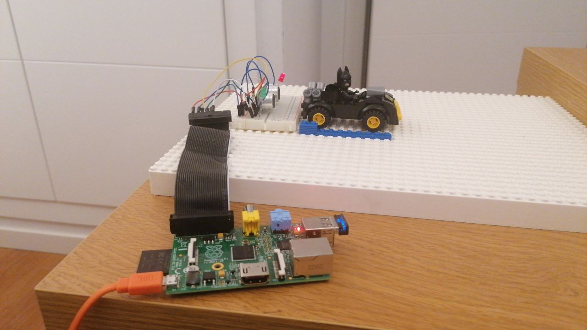
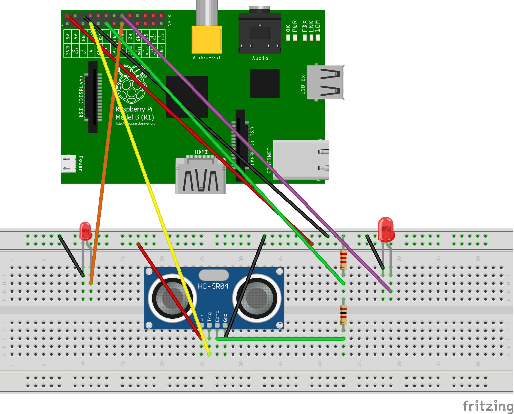

## IoT Raspberry Pi sr04 sensor AWS IoT demo.

This example has part from an IoT workshop.

The main idea of the demo is recreate an smart parking place with lego example. We are using a Raspberry Pi board with an ultrasound sensor sr04 to measure distance between sensor and nearest object.
When the parking place is busy red led will be turn on and when the the parking place is free green led will turn on.
We are using  AWS IoT core as a platform service throught python sdk.



#### Step 1

Connect Raspberry Pi with sensor and leds by this way (change one of this leds by green led).



### Step 2

Clone this repo inside Raspberry pi device.

### Step 3

Create an iot device on AWS IOT, you can follow this guide:
https://docs.aws.amazon.com/iot/latest/developerguide/create-iot-resources.html

### Step 4

Replace your AWS IoT device credentials in python script.

```
    myShadowClient = AWSIoTMQTTShadowClient("AWS_IOT_DEVICE_NAME")
    myShadowClient.configureEndpoint("AWS_IOT_ENDPOINT", 8883)
    myShadowClient.configureCredentials("AWS_IOT_CA_CRT",
      "AWS_IOT_PRIVATE_KEY",
      "AWS_IOT_CERT_PEM")
```
 
### Step 5

Run!
